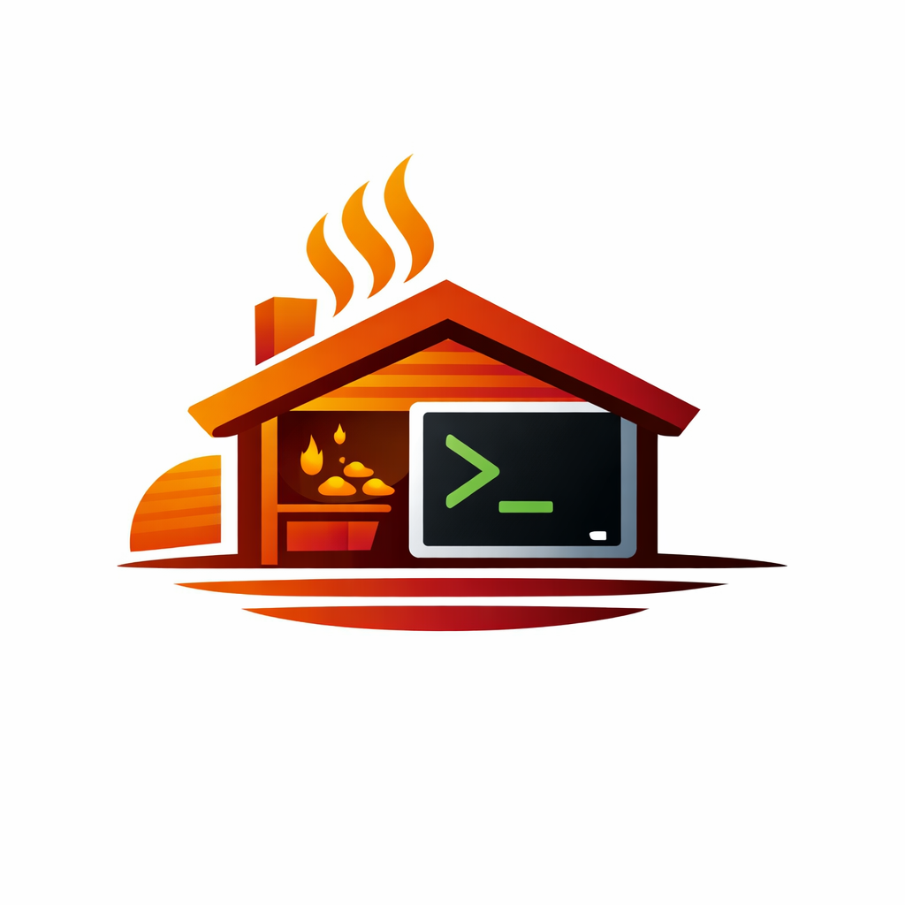

<p align="center">
  
</p>

<h1 align="center">Klafs Sauna Control</h1>

<p align="center">
  A Rust library and CLI for controlling Klafs saunas via their cloud API.
</p>

<p align="center">
  <a href="https://crates.io/crates/klafs-api"></a>
  <a href="https://crates.io/crates/klafs-api"></a>
  <a href="https://docs.rs/klafs-api"></a>
  <a href="https://github.com/dobermai/sauna/actions/workflows/ci.yml"></a>
</p>

<p align="center">
  <a href="#license"></a>
  <a href="https://www.rust-lang.org/"></a>
  <a href="#"></a>
</p>

<p align="center">
  <strong>⚠️ Unofficial project — not affiliated with KLAFS GmbH & Co. KG</strong>
</p>

## Overview

This project provides:

- **klafs-api** - A Rust library for interacting with the Klafs sauna API
- **sauna** - A command-line tool for controlling your sauna

## Quick Start

```bash
# Login to your Klafs account (use your USERNAME, not email!)
sauna login

# Find your sauna ID and set it as default (auto-selects if only one sauna)
sauna saunas
sauna config --sauna-id "your-sauna-uuid" --pin "1234"

# Check status
sauna status

# Start your sauna
sauna power-on

# Or schedule it for later
sauna power-on --at 18:30

# Adjust settings
sauna set-temp 85
sauna set-mode sanarium

# Turn off
sauna power-off
```

> **Important**: Use your KLAFS **username**, not your email address, when logging in. This is the same username you use on the KLAFS web portal.

## Installation

### Homebrew (macOS)

```bash
brew install dobermai/tap/sauna
```

### Cargo

```bash
cargo install sauna
```

### Download Binary

Pre-built binaries are available for Linux, macOS, and Windows on the [Releases](https://github.com/dobermai/sauna/releases) page.

### From Source

```bash
git clone https://github.com/dobermai/sauna.git
cd sauna
cargo install --path sauna
```

### Platform Support

This project has been developed and tested on **macOS**. It should work on **Linux** and **Windows** as well, but these platforms have not been tested yet. If you encounter any issues on these platforms, please [open an issue](https://github.com/dobermai/sauna/issues) or submit a pull request.

## CLI Usage

### Global Flags

```bash
# Enable verbose logging
sauna --verbose <command>

# Enable HTTP debug logging (writes to file)
sauna --debug <command>

# Save debug output to a file (used with --debug)
sauna --debug-file debug.log <command>
```

### Login

Authenticate with your Klafs account. Credentials are stored securely in your system keyring.

```bash
sauna login
# Username and password will be prompted securely

# Provide credentials via flags
sauna login --username your_username --password your_password
```

> **Important**: Use your KLAFS **username**, not your email address. This is the same username you use on the KLAFS web portal.

> **Warning**: Klafs locks accounts after 3 failed login attempts!

### Discover Saunas

List all saunas registered to your account:

```bash
# Human-readable output
sauna saunas

# JSON output
sauna saunas --json
```

Example output:

```
Registered Saunas

* My Home Sauna
    ID: 364cc9db-86f1-49d1-86cd-f6ef9b20a490
    (default)

  Guest House Sauna
    ID: a1b2c3d4-e5f6-7890-abcd-ef1234567890

Use 'sauna config --sauna-id <ID>' to set a default.
```

### Configure Defaults

Set your default sauna ID to avoid specifying it with every command:

```bash
sauna config --sauna-id "your-sauna-uuid"

# Store PIN for power control (stored in system keyring)
sauna config --pin "1234"

# Auto-select is enabled by default and will pick the sauna automatically
# when exactly one sauna is registered.
# Disable auto-select behavior
sauna config --auto-select false

# View current configuration
sauna config --show
```

### Get Sauna Status

```bash
# Human-readable output
sauna status

# JSON output
sauna status --json

# Specify a different sauna
sauna status --sauna-id "another-sauna-uuid"
```

Example output:

```
Sauna Status

  Connection:     Connected
  Status:         Off

  Mode:           Sanarium
  Current Temp:   N/A
  Target Temp:    70°C

  Scheduled:      Not scheduled
```

When the sauna is heating:

```
Sauna Status

  Connection:     Connected
  Status:         Heating (45°C -> 85°C)

  Mode:           Sauna
  Current Temp:   45°C
  Target Temp:    85°C

  Remaining Time: 1h 30m
  Scheduled:      Not scheduled
```

### Power Control

```bash
# Power on immediately (requires PIN; uses stored PIN if not provided)
sauna power-on

# Schedule power on for a specific time
sauna power-on --at 18:30

# Provide PIN explicitly
sauna power-on --pin 1234

# Power off
sauna power-off
```

### Temperature and Mode

```bash
# Set temperature (10-100°C for Sauna, 40-75°C for Sanarium)
sauna set-temp 85

# Set mode: sauna or sanarium
sauna set-mode sauna
```

### Humidity Control

```bash
# Set humidity level (1-10, Sanarium mode only)
sauna set-humidity 7
```

### Scheduling

```bash
# Set scheduled start time (without starting)
sauna schedule 18:30

# Clear the schedule
sauna schedule --clear

# You can also clear by omitting the time
sauna schedule
```

### Profiles

Save and reuse sauna configurations locally:

```bash
# Create a profile
sauna profile create hot --mode sauna --temp 90
sauna profile create relaxed --mode sanarium --temp 60 --humidity 7

# List all profiles
sauna profile list

# Show profile details
sauna profile show hot

# Apply a profile (sets mode, temperature, humidity)
sauna profile apply hot

# Apply and start the sauna
sauna profile apply hot --start

# Delete a profile
sauna profile delete hot
```

Profiles are stored locally in `~/.config/klafs/profiles.toml`.

### Configure Multiple Settings

Set multiple parameters in one command:

```bash
# Set temperature and humidity (current mode)
sauna configure --temp 85 --humidity 5

# Set temperature and schedule
sauna configure --temp 85 --time 18:30

# Set all at once
sauna configure --temp 85 --humidity 5 --time 18:30
```

### Light Control

Control the cabin lights:

```bash
# Main light
sauna light on
sauna light on --brightness 8
sauna light off

# Sunset light
sauna sunset on
sauna sunset on --brightness 10
sauna sunset off
```

## Library Usage

Add to your `Cargo.toml`:

```toml
[dependencies]
klafs-api = "0.1"
tokio = { version = "1", features = ["rt-multi-thread", "macros"] }
```

Example:

```rust
use klafs_api::KlafsClient;

#[tokio::main]
async fn main() -> Result<(), Box<dyn std::error::Error>> {
    let client = KlafsClient::new()?;

    // Login (use your KLAFS username, not email!)
    client.login("your_username", "password").await?;

    // Get sauna status
    let status = client.get_status("your-sauna-uuid").await?;

    println!("Connected: {}", status.is_connected);
    println!("Powered On: {}", status.is_powered_on);
    println!("Current Temperature: {}°C", status.current_temperature);
    println!("Target Temperature: {}°C", status.target_temperature());

    if let Some(mode) = status.current_mode() {
        println!("Mode: {}", mode);
    }

    Ok(())
}
```

## API Reference

Base URL: `https://sauna-app-19.klafs.com`

### Endpoints

| Endpoint | Method | Description |
|----------|--------|-------------|
| `/Account/Login` | POST | Authenticate (form-encoded) |
| `/SaunaApp/ChangeSettings` | GET | List registered saunas (HTML) |
| `/SaunaApp/GetData?id={id}` | GET | Get sauna status (JSON) |
| `/SaunaApp/StartCabin` | POST | Power on sauna (supports scheduling) |
| `/SaunaApp/StopCabin` | POST | Power off sauna |
| `/SaunaApp/ChangeTemperature` | POST | Set target temperature |
| `/SaunaApp/ChangeHumLevel` | POST | Set humidity level |
| `/SaunaApp/SetMode` | POST | Set operating mode |
| `/SaunaApp/SetSelectedTime` | POST | Set scheduled start time |
| `/SaunaApp/LightChange` | POST | Control lights (main, color, sunset) |
| `/SaunaApp/SetBathingTime` | POST | Set session duration (**broken - see below**) |

### Sauna Modes

| Mode | Value | Temperature Range |
|------|-------|-------------------|
| Sauna | 1 | 10-100°C |
| Sanarium | 2 | 40-75°C |

### Operation Status Codes (opStatus)

| Code | Meaning |
|------|---------|
| 0 | Off |
| 1 | Scheduled (waiting for start time) |
| 2 | Heating |
| 3 | Ready |

## Project Structure

```
sauna/
├── Cargo.toml              # Workspace manifest
├── klafs-api/              # API client library
│   ├── src/
│   │   ├── lib.rs          # Public API
│   │   ├── client.rs       # HTTP client
│   │   ├── debug.rs        # HTTP traffic debugging
│   │   ├── error.rs        # Error types
│   │   └── models.rs       # Data models
│   └── tests/
│       ├── fixtures/       # Test fixtures (HTML, JSON)
│       └── integration_tests.rs
└── sauna/                  # CLI application
    └── src/
        ├── main.rs         # CLI commands
        ├── config.rs       # Configuration & keyring
        └── profiles.rs     # Profile storage
```

## Security Notes

- Credentials are stored in your system's secure keyring (macOS Keychain, Windows Credential Manager, or Linux Secret Service)
- The PIN for power control is also stored securely in the keyring
- Session cookies are managed in-memory and not persisted to disk
- **Klafs locks accounts after 3 failed login attempts** - be careful with automated scripts

## Unsupported Features

The following Klafs features are **not currently supported**:

- **Bathing duration (session length)** - The `SetBathingTime` API endpoint exists and accepts requests, but the sauna ignores the setting. This appears to be a server-side bug.
- **Infrared mode** - Cannot be tested/verified without hardware access
- **Color light** - Cannot be tested/verified without hardware access
- **Light status** - API does not report accurate light state; control commands work but status is unreliable
- **Klafs Favorites** - Server-side favorites have no list API; use local profiles instead

## Roadmap

- [x] Core library with login and status
- [x] CLI with credential storage
- [x] Sauna discovery (list registered saunas)
- [x] Power on/off commands
- [x] Temperature, mode, humidity control
- [x] Scheduling (immediate and timed start)
- [x] Profiles feature (save/apply configurations)
- [x] Combined configure command
- [x] HTTP traffic debugging
- [x] Integration tests with mock server
- [ ] UniFFI bindings for iOS/macOS Swift apps
- [ ] TUI interface (ratatui-based)

## Contributing

Contributions are welcome! If you'd like to help:

- **Report bugs** or **request features** by [opening an issue](https://github.com/dobermai/sauna/issues)
- **Submit pull requests** for bug fixes or new features
- **Test on other platforms** (Linux, Windows) and report your findings

## Acknowledgments

Inspired by other community projects:
- [dss-vdc-klafs](https://github.com/axe-world/dss-vdc-klafs)
- [IPSymconKlafsSaunaControl](https://github.com/Pommespanzer/IPSymconKlafsSaunaControl)

## Disclaimer & Legal

### Trademark Notice

"KLAFS" is a registered trademark of KLAFS GmbH & Co. KG. This project is not affiliated with, endorsed by, sponsored by, or otherwise connected to KLAFS GmbH & Co. KG. All product and company names are trademarks or registered trademarks of their respective holders. Use of them does not imply any affiliation or endorsement.

### No Warranty

THIS SOFTWARE IS PROVIDED "AS IS", WITHOUT WARRANTY OF ANY KIND, EXPRESS OR IMPLIED, INCLUDING BUT NOT LIMITED TO THE WARRANTIES OF MERCHANTABILITY, FITNESS FOR A PARTICULAR PURPOSE AND NONINFRINGEMENT. IN NO EVENT SHALL THE AUTHORS OR COPYRIGHT HOLDERS BE LIABLE FOR ANY CLAIM, DAMAGES OR OTHER LIABILITY, WHETHER IN AN ACTION OF CONTRACT, TORT OR OTHERWISE, ARISING FROM, OUT OF OR IN CONNECTION WITH THE SOFTWARE OR THE USE OR OTHER DEALINGS IN THE SOFTWARE.

### Use at Your Own Risk

- This software interacts with third-party services and hardware. The authors are not responsible for any damage to your sauna, property, or any other consequences resulting from the use of this software.
- The API may change at any time without notice, which could break functionality.
- Improper use of sauna equipment can be dangerous. Always follow the manufacturer's safety guidelines.
- **Klafs locks accounts after 3 failed login attempts.** Be careful with automated scripts.

### Intended Use

This software is intended for personal, non-commercial use by owners of Klafs saunas who wish to integrate their sauna with home automation systems or control it via command line. It is provided for educational and interoperability purposes.

## License

Licensed under either of:

- Apache License, Version 2.0 ([LICENSE-APACHE](LICENSE-APACHE) or http://www.apache.org/licenses/LICENSE-2.0)
- MIT License ([LICENSE-MIT](LICENSE-MIT) or http://opensource.org/licenses/MIT)

at your option.
